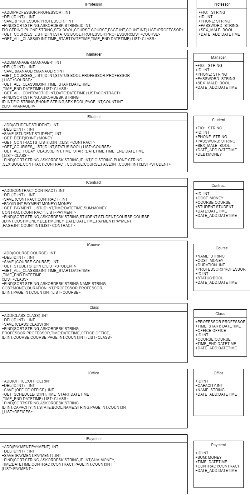

# Факультативные занятия на базе университета
## Схема интерфейсов

### Список интерфейсов
- [IProfessor](Git+MD/IProfessor.md)
- [IManager](Git+MD/IManager.md)
- [IStudent](Git+MD/IStudent.md)
- [IContract](Git+MD/IContract.md)
- [ICourse](Git+MD/ICourse.md)
- [IClass](Git+MD/IClass.md)
- [IOffice](Git+MD/IOffice.md)
- [IPayment](Git+MD/IPayment.md)
## Диаграммы

+ [Диаграмма размещения](Git+MD/размещение.md)
+ [Диаграммы последовательности](Git+MD/последовательность.md)
+ [Диаграммы действий](Git+MD/действвий.md)
+ [Диаграмма состояния](Git+MD/состояния.md)
+ [Диаграмма классов](Git+MD/классо.md)
+ [Схема БД](Git+MD/БД.md)
+ [Схема прецедентов](Git+MD/Прецедентов.md)
