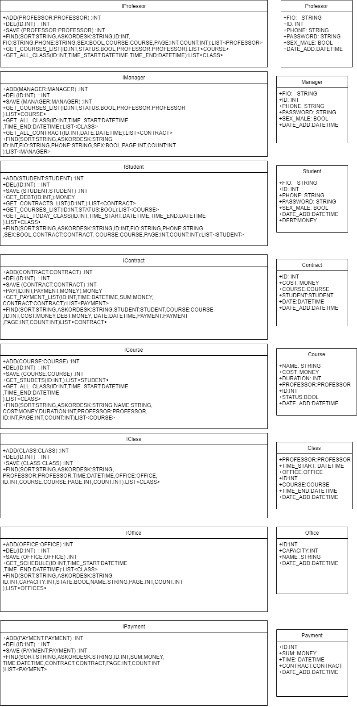

# Факультативные занятия на базе университета
## Схема интерфейсов

### Список интерфейсов
- [IProfessor]()
- [IManager]()
- [IStudent]()
- [IContract]()
- [ICourse]()
- [IClass]()
- [IOffice]()
- [IPayment]()
## Диаграммы
+ [Интерфейсы]()
+ [Диаграмма размещения]()
+ [Диаграммы последовательности]()
+ [Диаграммы действий]()
+ [Диаграмма состояния]()
+ [Диаграмма классов]()
+ [Схема БД]()
+ [Схема прецедентов]()
